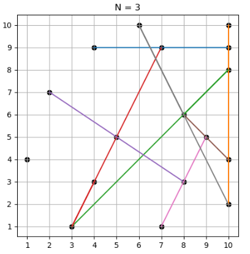

# COLLINEAR POINTS APP

## What is this repository for? ##
Python code in this repo serves for solving a specific problem within a developer candidate test. Licensed under the GPLv3.

## Problem description

Given a set of feature points in the bidimensional plane, determine every line that contains at least N or more collinear points (point coordinate in integer values).

Manage data through this REST API:

* `[POST]/point` adds a new point in space
* `[GET]/lines/{n}` gets all lines passing through at least N points (a line segment is a set of collinear points)

## Repo structure ##

## How do I get set up? ##
### Python Dependencies

## Deployment instructions

### Logging

## Who do I talk to? ##

* Repo owner: [Yaroslav Vasyunin](https://www.linkedin.com/in/vasyunin/)