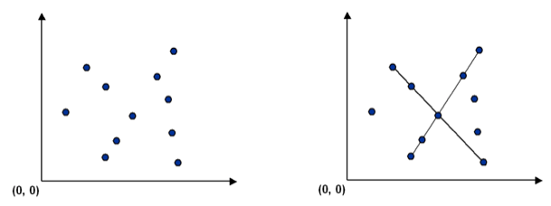
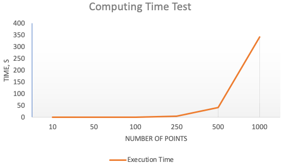
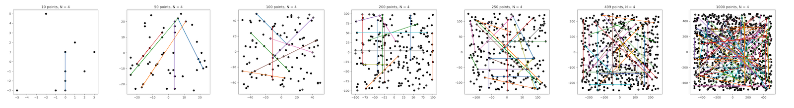

# COLLINEAR POINTS APP

Python code in this repo serves for solving a specific problem within a developer candidate test. It is a Flask-based web application that provides a simple API. Available at [collinearity-checker.herokuapp.com](https://collinearity-checker.herokuapp.com/v1), licensed under the GPLv3. 

## Problem

### Description

1. Given a set of feature points in the bi-dimensional plane, determine every line that contains at least N or more collinear points (point coordinate in integer values).

   

2. Manage data through this REST API:

   - `[POST]/point` adds a new point in space
   - `[GET]/lines/<n>` gets all lines passing through at least N points (a line segment is a set of collinear points)

### Solution

1. Create all possible pairs of points in the 2d space, so that each pair `(x1, y1)` and `(x2, y2)` defines a strait line. 

2. For every line, check that a given point `(x, y)`, if it is not already on the line ends, is on that straight line using the following equation:
    ```
    (y1 - y2) * x + (x2 - x1) * y + (x1 * y2 - x2 * y1) == 0
    ```
3. If the given point `(x, y)` is collinear with the line, add point coordinates to a set of line coordinates.

4. Repeat for all remaining points.

### Validation dataset


## How do I get set up?

This algorithm is realized in a Flask web application. Point coordinates are stored inside an object and remain for the lifetime of the app. This app is deployed on [Heroku](https://www.heroku.com), and it is available at [collinearity-checker.herokuapp.com](https://collinearity-checker.herokuapp.com/v1). Please note that when the app on Heroku doesn't receive any traffic in 1 hour, it goes to sleep. If the sleeping web app receives web traffic, it will become active again after a short delay.

For local deployment, make sure that the `app` folder is a working directory for the app. Run `app.py`. It will start a Flask web app on your `localhost`, port `5000`. By default, bi-dimensional space doesn't have any points in it.

### Repo structure

- **app** — source code directory
  - **tests**
    - [test_api.py](app/tests/test_api.py) — a test to assert the correctness of the responses from API
    - [test_main.py](app/tests/test_main.py) — a test that asserts the correctness of the Cartesian plane object. It uses hardcoded point data for validation of the collinearity.
  - [api.py](app/api.py) — Flask api
  - [main.py](app/main.py) — contains a class used by the API
  - [Procfile](app/Procfile) — lists the process types in the app, used for hosing on Heroku
  - [requirements.txt](app/requirements.txt) — necessary Python dependencies
  - [runtime.txt](app/runtime.txt) — specifies a Python runtime for Heroku
- **resources** — pictures for this README.md

## API

#### `[GET]/points`

List all points.

`curl -X GET https://collinearity-checker.herokuapp.com/v1/point`

####`[POST]/points`

Add a new point by providing parameters *x* and *y*. You can't add more than 100 points, because it is the allowed limit (see Performance section below).

`curl -X POST -F "x=-10" -F "y=15" https://collinearity-checker.herokuapp.com/v1/point`

#### `[DELETE]/points` 

Delete all points.

`curl -X DELETE https://collinearity-checker.herokuapp.com/v1/point`

#### `[GET]/lines/<n>` 

List all groups of collinear points. The minimum allowed number of points in a group `<n>` that you provide at the end of URL is 3.

`curl -X GET https://collinearity-checker.herokuapp.com/v1/line/5`

#### `[GET]/plot`

Show a plot with points and lines. You can plot them in a browser — open this link:

`https://collinearity-checker.herokuapp.com/v1/plot`
 
## Performance

- The requested amount of N, collinear points in a segment, doesn't affect the performance.
- The bottleneck of the app is the collinearity check, which runs as a nested loop, i.e. for every line segment it checks every point. This approach increases computing time exponentially, as shown on a graph below. That is why the maximum amount of 2d points is limited to 100.

    

    

- One approach to boost the app speed would be to use spatial indices for preliminary filtering of irrelevant points for every segment (before going to the nested loop). It should be possible to implement this solution using [Shapely](https://pypi.org/project/Shapely/).

- Another way, useful for scaling the application in the cloud, would be to apply a PostgreSQL database to store points as Geometry features. Powered by [PostGIS](http://postgis.net) extension, PostgreSQL gives many time-proven tools for spatial relationship analysis.

## Who do I talk to?

* Repo owner: [Yaroslav Vasyunin](https://www.linkedin.com/in/vasyunin/)
