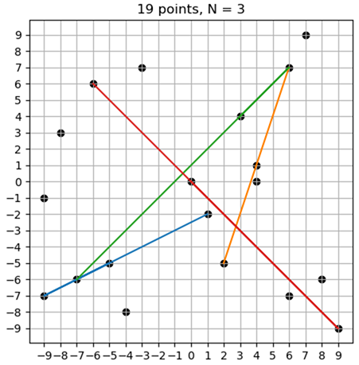

# COLLINEAR POINTS APP

## What is this repository for?
Python code in this repo serves for solving a specific problem within a developer candidate test. It is a Flask-based web application that provides a simple API to solve a sepcific problem, licensed under the GPLv3.

## Problem description

Given a set of feature points in the bidimensional plane, determine every line that contains at least N or more collinear points (point coordinate in integer values).



Manage data through this REST API:

* `[POST]/point` adds a new point in space
* `[GET]/lines/{n}` gets all lines passing through at least N points (a line segment is a set of collinear points)

## Repo structure ##

- `app/main.py` — the main application script.
- `app/fucntions.py` — functions used by the main script.
- `app/Procfile` — lists the process types in an application. Each process type is a declaration of a command that is executed when a container of that process type is started. Used for hosing on Heroku.
- `app/requirements.txt` — necessary Python libraries
- `app/runtime.txt` — specifies a Python runtime for Heroku.
- `resources/*` — pictures for this README.
- `tests/test_algorithm_auto.py` — a unit test that can be run automatically to assert the correctness of the collinearity check. It uses hardcoded validation data, which are shown on a plot in the beginning of this README.
- `tests/test_flask_manual.py` — a manual test for a running Flask application to experiment with API.

## Problem solution

1. Create all possible pairs of points in the 2d space, so that each pair `(x1, y1)` and `(x2, y2)` defines a strait line. 

2. For every line, check that a given point `(x, y)`, if it is not already on the line ends, is on that straight line using the following equation:
    ```
    (y1 - y2) * x + (x2 - x1) * y + (x1 * y2 - x2 * y1) == 0
   ```
3. If the given point `(x, y)` is collinear with the line, add point coordinates to a set of line coordinates.
4. Repeat for all remaining points.

This algorithm is realized in a Flask web application. The point coordinates are stored for the lifetime of the app.

## How do I get set up?

### Localhost

Make sure that the `app` folder is a working directory for the app, otherwise import statements may not work. Run `main.py`. It will start a Flask web app on your `localhost`, port `5000`. By default, bidimentional space doesn't have any points in it.

Use the following requests to interact with API. Examples are given for a command line utility `curl`.

Add one point (x: -10, y: 15)

```bash
curl -X POST -F "x=-10" -F "y=15" http://127.0.0.1:5000/point
```

See all added points:

```bash
curl -X GET http://127.0.0.1:5000/point
```

If you try to add more than 100 points, you get a response code `304 Not Modified`, because it is the allowed limit. To clean all your point:

```bash
curl -X DELETE http://127.0.0.1:5000/point
```

After you filled the space with points, you can estimate, which of them are collinear. The following request will return only line segments with 5 or more collinear points:

```bash
curl -X GET http://127.0.0.1:5000/line/5
```

Finally, as you detected the collinear points and line segments, you can plot them in a browser — just open this link:
```
http://127.0.0.1:5000/plot.png
```

Every time you run `[GET]/line/{n}`, the plot gets reset. So when you request the plot again, you get the relevant version of the plot.

### Web

This app is deployed on [Heroku](https://www.heroku.com) and it is available at [collinearity-checker.herokuapp.com](https://collinearity-checker.herokuapp.com/) instead of `http://127.0.0.1:5000`. Please note that when the app on Heroku doesn't receive any traffic in 1 hour, it goes to sleep. If the sleeping web app receives web traffic, it will become active again after a short delay.
 
## Performance

* Amount of the requested N (collinear points in a segment) doesn't affect the performance.
* The bottleneck of the app is the collinearity check, which runs as a nested loop, i.e. for every line segment it checks every point. This approach increases computing time exponentially, as shown on a graph below. That is why the maximum amount of points to plot is limited to 100.

    

    

A good approach to boost the app speed would be to use spatial indices for a preliminary filtering of irrelevant points for every segment (before going to the nested loop). It should be possible to implement this solution using [Shapely](https://pypi.org/project/Shapely/).

## Who do I talk to?

* Repo owner: [Yaroslav Vasyunin](https://www.linkedin.com/in/vasyunin/)
